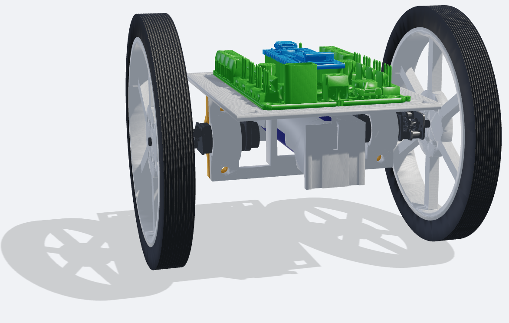

# BalanceBot

A two-wheeled self-balancing robot (inverted pendulum) built on an **Arduino Nano 33 IoT** with a **Nano Motor Carrier**.

<p align="center">
  
</p>

The motivation behind this project is to develop a fully open-source robot from the existing components of the Arduino Engineering Kit Rev2. This allows interested owners of the kit to take the next step and gain a sustainable, license-independent engineering solution. Starting from these components, all necessary development steps and following design decisions are explained comprehensible in the documentation and provided in this repo. To keep the development effort manageable while leveraging the latest technology, [Agentic Supremacy](https://github.com/5omeOtherGuy/claude-skills-deploy) was developed and applied for this project.

The project follows a structured commissioning approach: each hardware subsystem is characterised and validated before the control loop is tuned.

## Hardware

| Component | Detail |
|-----------|--------|
| MCU | Arduino Nano 33 IoT (SAMD21, WiFi/BLE) |
| Motor driver | Arduino Nano Motor Carrier |
| IMU | BNO055 (9-DOF, on-chip fusion) |
| Motors | 2 x micro gear motors, 100:1 ratio |
| Encoders | 2 x magnetic, 1200 counts/rev |
| Frame | Custom design (FreeCAD) |

## Repository layout

```
Balancebot_code/
  src/balance/          Modular firmware (active development)
  src/balance.cpp       balance_v1 — monolithic reference (read-only)
  src/tests/            Test sketches (carrier_timing, imu_latency, deadzone_id)
  python/               acquire → process → analyze data pipeline
  docs/                 commissioning_plan, sign_conventions, system_model
  messungen/            Measurement data (results tracked in repo)

CAD_BalanceBot/         FreeCAD assembly, STEP files, CoM analysis

docs/adr/               Architecture Decision Records (ADR-0001 … 0007)
Knowledg/               Physics derivations and explanations
```

## Firmware environments

Built with [PlatformIO](https://platformio.org/). Each environment compiles a different firmware:

| Environment | Purpose |
|-------------|---------|
| `balance` | Modular control loop (active development) |
| `balance_v1` | Original monolithic firmware (reference) |
| `carrier_timing` | I2C timing characterisation |
| `imu_latency` | BNO055 read latency measurement |
| `deadzone_id` | Motor deadzone identification |

```bash
pio run -e balance -t upload     # flash
pio device monitor               # serial monitor
```

## Data pipeline

A three-stage Python pipeline for measurement acquisition and analysis:

```bash
python python/acquire.py                    # record serial data
python python/process.py <raw_file.csv>     # validate and compute derived signals
python python/analyze.py <proc_file.csv>    # generate plots
```

## Commissioning phases

The robot is brought up in phases — each phase validates assumptions the next one depends on. See [`commissioning_plan.md`](Balancebot_code/docs/commissioning_plan.md) for details.

| Phase | Goal | Status |
|-------|------|--------|
| 0 | Hardware verification | pending |
| 1 | Motor Carrier I2C timing | pending |
| 2 | BNO055 mode decision | pending |
| 3 | Deadzone identification | pending |
| 4 | Centre-of-gravity measurement | pending |
| 5 | System model | pending |
| 6 | First balance attempt (PD) | pending |
| 7 | Position controller | pending |

## Key design decisions

Documented as [Architecture Decision Records](docs/adr/README.md):

- **ADR-0001** Modular firmware layout supersedes balance_v1
- **ADR-0003** Motor duty hard-capped at 45 % (driver current limit)
- **ADR-0004** Three-stage Python pipeline supersedes standalone scripts
- **ADR-0005** PlatformIO as build system
- **ADR-0006** Control loop fixed at 10 ms (100 Hz)

## Getting started

### Prerequisites

- [PlatformIO CLI](https://docs.platformio.org/en/latest/core/installation.html)
- Python 3.12+ with dependencies: `pip install -r Balancebot_code/python/requirements.txt`
- Arduino Nano 33 IoT connected via USB

### Build and flash

```bash
cd Balancebot_code
pio run -e balance -t upload
```

### Lint

```bash
make lint    # runs ruff on the Python pipeline
```

## License

This project is developed as a university/hobby project. No license has been chosen yet.
